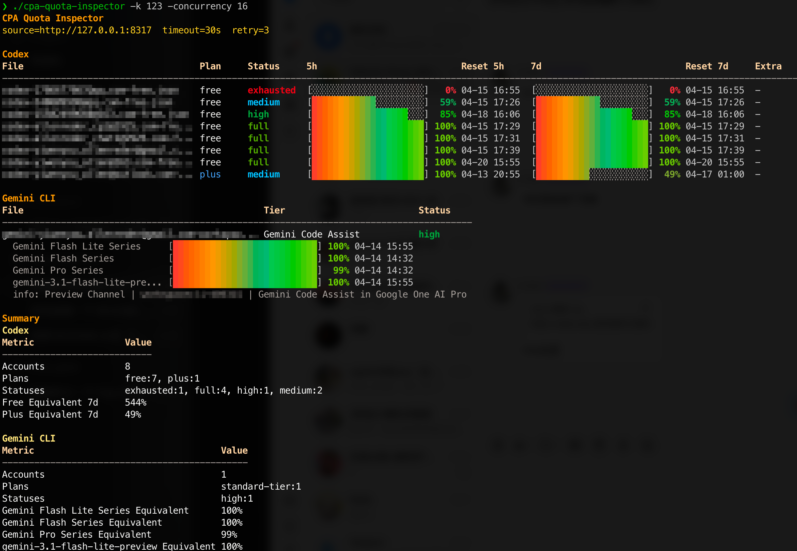

# CLIProxyAPI Quota Inspector

---



基于 CPA 管理接口的多 provider 实时配额查询工具。

该项目通过已运行的 CPA 服务读取真实配额数据，并按 provider 分区输出终端报表，支持状态着色、配额进度条和多账号汇总统计。

## 作用

- 使用在线数据，不做离线估算。
- 不强行把所有 provider 映射成同一张表，而是按 provider 分区展示。
- 展示 Codex 的 `5h` 与 `7d` 配额窗口。
- 展示 Gemini CLI 的模型额度分组与补充信息。
- 汇总不同计划的等效百分比（`free`、`plus`）。
- 查询大量账号时显示实时进度（含当前凭证文件名）。

## 数据来源

工具复用 CPA 当前支持提供方的查询链路：

1. `GET /v0/management/auth-files`
2. `POST /v0/management/api-call`
3. 再由 CPA 转发到各 provider 的真实上游接口

当前已实现：

- Codex -> `https://chatgpt.com/backend-api/wham/usage`
- Gemini CLI -> `https://cloudcode-pa.googleapis.com/v1internal:retrieveUserQuota`
- Gemini CLI 补充 tier 信息 -> `https://cloudcode-pa.googleapis.com/v1internal:loadCodeAssist`

## 状态规则

Codex 状态按 `7d` 剩余额度计算：

- `0` -> `exhausted`
- `0-30` -> `low`
- `30-70` -> `medium`
- `70-100` -> `high`
- `100` -> `full`

Gemini CLI 状态按所有已识别模型额度的平均剩余百分比计算，使用同一套等级：

- `0` -> `exhausted`
- `0-30` -> `low`
- `30-70` -> `medium`
- `70-100` -> `high`
- `100` -> `full`

## 功能特性

- 默认静态报表输出（非交互模式）
- 按 provider 分区渲染，列定义彼此独立
- 表格宽度自适应终端
- 默认 Unicode 渐变进度条，可切换 ASCII
- 可选实时查询进度条
- 支持 `pretty` / `plain` / `json` 三种输出
- `plain` 与 `json` 也会按 provider 输出独立汇总
- 支持失败重试

## 运行要求

- Go `1.25+`
- CPA 服务已启动
- 管理密钥（若 CPA 开启鉴权）

## 构建

```bash
go build -o cpa-quota-inspector .
```

## 快速使用

```bash
./cpa-quota-inspector -k YOUR_MANAGEMENT_KEY
```

## 参数说明

- `--cpa-base-url`: CPA 地址，默认 `http://127.0.0.1:8317`
- `--management-key`, `-k`: 管理密钥
- `--concurrency`: 并发查询数
- `--timeout`: 请求超时秒数
- `--retry-attempts`: 临时失败重试次数
- `--version`: 输出版本/构建信息
- `--filter-provider`: 按 provider 过滤，例如 `codex`、`gemini-cli`
- `--filter-plan`: 按计划类型过滤
- `--filter-status`: 按状态过滤
- `--json`: 输出 JSON
- `--plain`: 输出纯文本
- `--summary-only`: 仅输出汇总
- `--ascii-bars`: 使用 ASCII 进度条
- `--no-progress`: 关闭查询进度显示

## 示例

JSON 输出：

```bash
./cpa-quota-inspector \
  --json \
  -k YOUR_MANAGEMENT_KEY
```

关闭查询进度：

```bash
./cpa-quota-inspector \
  --no-progress \
  -k YOUR_MANAGEMENT_KEY
```

使用 ASCII 进度条：

```bash
./cpa-quota-inspector \
  --ascii-bars \
  -k YOUR_MANAGEMENT_KEY
```

仅查看 Gemini CLI：

```bash
./cpa-quota-inspector \
  --filter-provider gemini-cli \
  -k YOUR_MANAGEMENT_KEY
```

查看版本信息：

```bash
./cpa-quota-inspector --version
```

## 排序与汇总

- 默认排序按 provider 分别处理：
  - Codex：先按计划优先级（`free`、`team`、`plus`、其他），再按 `7d` 剩余额度升序
  - Gemini CLI：先按状态，再按可用模型信息，最后按文件名
- 终端汇总按 provider 分块显示：
  - Codex：`Accounts`、`Plans`、`Statuses`、`Free Equivalent 7d`、`Plus Equivalent 7d`
  - Gemini CLI：`Accounts`、`Plans`、`Statuses`、各模型分组的 `Equivalent`
- JSON 输出除全局 `summary` 外，还包含 `provider_summaries`

## 代码结构

- `main.go`: 入口与流程编排
- `types.go`: 常量与数据模型
- `fetch.go`: 通用管理接口请求、过滤和汇总
- `providers.go`: provider 注册与各 provider 查询逻辑
- `render.go`: 终端报表渲染
- `helpers.go`: 通用辅助函数

## 开发

```bash
gofmt -w *.go
go test ./...
```

## 发布

创建并推送语义化标签：

```bash
git checkout main
git pull
git tag -a v0.1.0 -m "v0.1.0"
git push origin v0.1.0
```

使用 GoReleaser 构建多平台产物：

```bash
goreleaser release --clean
```

## 说明

- 当前不展示 code review 配额。
- 当前正式支持 `Codex + Gemini CLI`。
